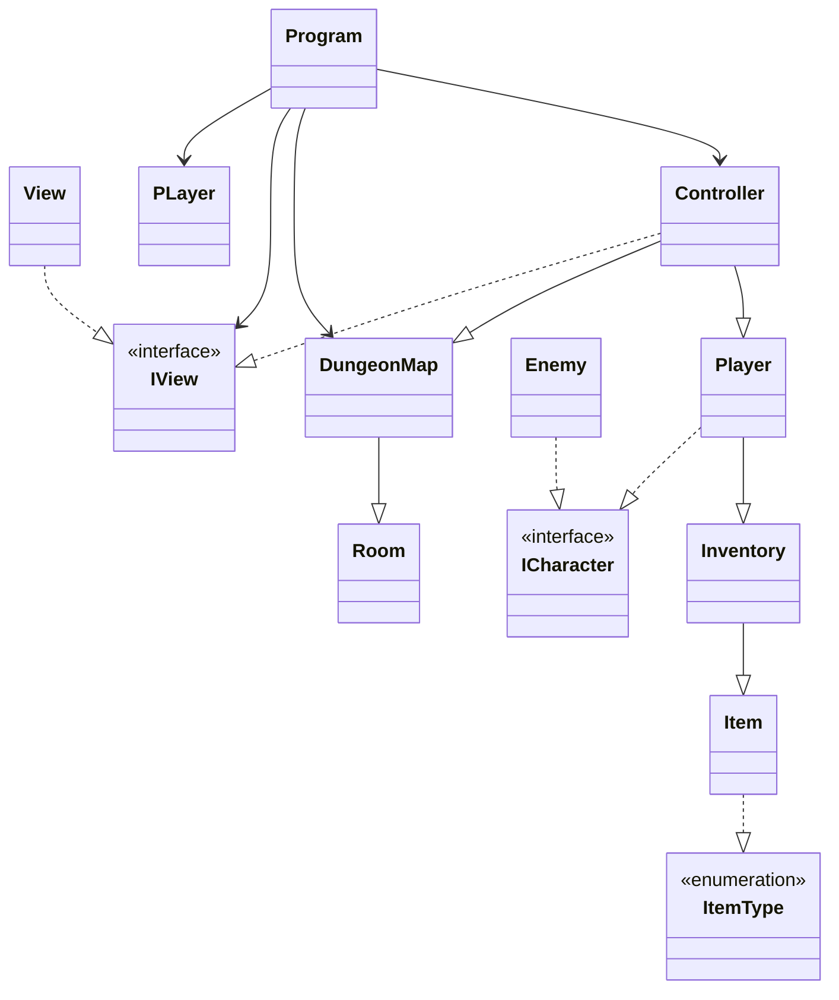

        # Yet Another Dungeon Crawler

## Autoria

Nome dos Autores:
- Catarina Fuscaliuc (22303056)
- Gabriela Oliveira (22302388)

### Contribuições dos Autores
- **Catarina Fuscaliuc**: A criação do README.md, Mapa do jogo .
- **Gabriela Oliveira**: Implementação das classes principais, Interfaces e Sistema de itens e integração com a lógica de combate  .

## Repositório Git
O repositório do projeto pode ser encontrado [aqui] (https://github.com/GabrielaBranco/Yet-Another-Dungeon-Crawler.git).

## Arquitetura da Solução
### Descrição da Solução
As classes estão organizadas de acordo com o padrão de arquitetura MVC

Classes:
	Controller - A classe Controller é responsável por coordenar a lógica do jogo e o controle do fluxo de dados. 
	View - Responsável pela parte visual do código e por recolher e enviar os inputs do jogador.
	
	Models:
		Player - É responsável pela lógica do jogador e suas propriedades. Herda da interface ICharacter.
		Enemy - É responsável pela lógica do inimigo e suas propriedades. também herda da interface ICharacter.
		Item - Representa um item no jogo, como uma arma, armadura, poção. Os itens podem ser encontrados em salas, coletados pelo jogador e usados em combate. Gerencia a lógica e os dados relacionados aos itens do jogo.
		Inventory - É responsável pela lógica de coletar itens e adicionar eles à uma lista. Pode ser aberto durante o combate, dando ao jogador a possibilidade de usar um ou mias itens da lista.
		Room - Representa uma sala do jogo, em que o jogador pode encontrar itens ou inimigos e se mover para o Norte, Sul, Leste e Oeste onde o jogador pode encontrar protas que dão para outras salas
		DungeonMap - É responsável por abrir o arquivo de texto com a informação dos "rooms", ler e atribuir seus valores à um room. 

	Interfaces:
		ICharacter - É a interfaçe implementada por entidades do jogo(neste caso Player e Enemy). Especifica propriedades comuns a todos os personagens, como nome, saúde, poder de ataque e defesa. Além disso, inclui um método para atacar outro personagem.

		IView - Responsável por interagir com o jogador e exibir mensagens no console.

	Enum:
		ItemType - Define os tipos de item que podem ser encontrados pelo jogador, que são: Weapon, Gear e Potion.

### Diagrama UML de Classes

## Referências

### Trocas de ideias com colegas
Discussões sobre a implementação do sistema, organização do mapa e tarefas distribuidas.

### Código fornecido por IAS generativas
Utilização do ChatGPT para obter sugestões de otimização de erros, consulta do codigo git. 
- **Sistema utilizado**: ChatGPT.

### Código aberto reutilizado:
(https://patorjk.com/software/taag/#p=display&f=Epic&t=)

(https://www.dotnetperls.com/console-color)

(https://www.daniweb.com/programming/software-development/threads/475572/changing-color-of-font-within-a-single-console-writeline)

StackOverflow
